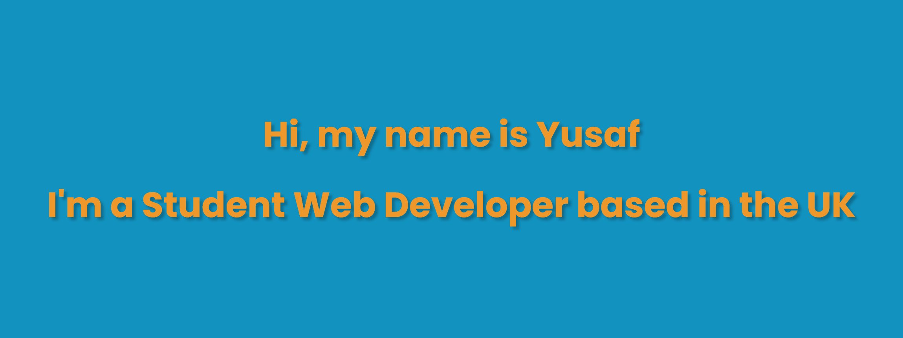

### Hi there 👋

<!--
**YusafS94/YusafS94** is a ✨ _special_ ✨ repository because its `README.md` (this file) appears on your GitHub profile.

Here are some ideas to get you started:

- 🔭 I’m currently working on ...
- 🌱 I’m currently learning ...
- 👯 I’m looking to collaborate on ...
- 🤔 I’m looking for help with ...
- 💬 Ask me about ...
- 📫 How to reach me: ...
- 😄 Pronouns: ...
- ⚡ Fun fact: ...
-->

- 🔭 Working on a Front-End mobile MMA app
- 🌱 I’m currently learning Node JS, API development using Express and Axios, and React
- 👯 Looking to collaborate on anything fun, especially if it involves 3D/three.js
- 💻 Portfolio: https://yusafs94.github.io/Portfolio/

Skills:
 
🖥️ Frontend: HTML, CSS, JavaScript, Fetch API
 
🌐 Backend: PHP, SQL, Node js, Express, Axios
 
🖼️ Design: Figma, Illustrator
 
🏗️ Frameworks: Tailwind, React
